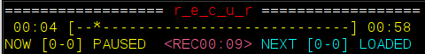
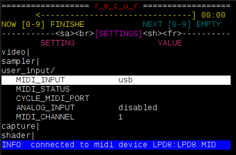
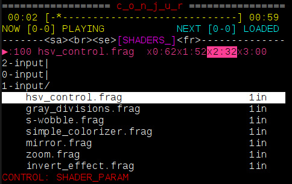
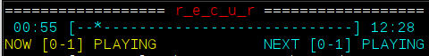
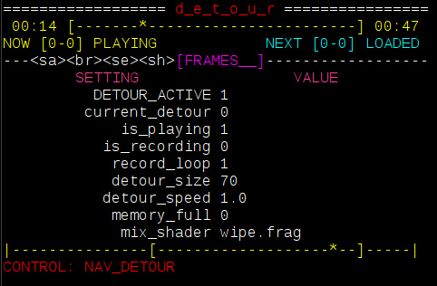

# how to use r_e_c_u_r

## getting started

- prepare a usb with some videos you want to sample
- connect the hdmi output or composite (via [3.5mm trrs]) to the display you want to use
- power the raspberry pi. you should see red lights on the pi board, the lcd display light up and the r_e_c_u_r splash screen on your video output
- after a few moments the interface should appear on lcd screen.

## controlling the sampler

## controls

![keys][keys]

the controls on r_e_c_u_r work by mapping `keys` to `actions`. this map can be fully customised by editing the respective [json file].

the default layout uses a hard mapping for every key except the `<` - `>` - `■` in red. this means every other key triggers the same actions independent of the state r_e_c_u_r is in.

the _control keys_ ,`<` - `>` - `■` use a soft mapping. the action they trigger depends on the state , displayed on screen as `control_mode` in red.

these let you navigate and select folders, video files and settings when in `BROWSER` / `SETTINGS` mode, and by default control video playback (seek forward and back, pause/play) of the currently playing [NOW] sample in `SAMPLER` mode.

the display modes `SAMPLER`, `BROWSER` and `SETTINGS` are cycled by using the `DSPLY` key. (`FN + DSPLY` cycles back)

some actions are accessible through a _function_ layer, toggled by the `FN` key.

- `→` (`SWITCH`) is used to switch the [NEXT] loaded sample to the [NOW] current sample
- loading the sample in slot `x` into [NEXT]; where `x` is a key from `0` to `9`
- cropping the current sample to start  (`[`) or end (`]`) at the current time
- cycling forward (`PRV BNK`) or back (`NXT BNK`) through the banks of sampleS , or clearing a bank (`CLR BNK`)

some keys are empty to leave room for future features and user experimentation. i encourage you to modify your keymap or add custom actions you would like to use.

## parts of the lcd display

![display_image][display_image]

## `PLAYER` display

![player_example][player_example]

this section displays information about what is in the video player : the position from the start and the end of currently playing sample (yellow), what slot is playing [NOW] and what slot is loaded [NEXT] 

## `SAMPLER` display mode

![sampler_example][sampler_example]

this is the main display mode for using r_e_c_u_r. from this view you can see details of all the samples loaded into the sampler. a `bank` contains 10 `slots` labelled `0` - `9`. pressing the corresponding `key` will load the `sample` in this `slot` to start when the current sample finishes. the `slot` of the currently playing sample is highlighted.

## `BROWSER` display mode

![browser_example][browser_example]

this is where you can load samples from your usb or internal Videos folder into the `SAMPLER`

- in this mode ,  the `<` and `>` keys will move the selection up and down
- folders are displayed ending in `|` for closed and `/` for open , the depth is displayed as indentation
- pressing the `■` key while a folder is selected toggles it open/closed
- pressing the `■` key while a video is selected loads it into the next available slot (note : you can see the first slot a video is loaded into on right column)

## `SETTINGS` display mode

![settings_example][settings_example]

this is where you can configure r_e_c_u_r's settings.

- navigate the menu with `<` and `>` keys like above
- pressing `■` on a setting will either cycle through it's `options` or run an `action` depending on its type

## `MESSAGE DISPLAY`

the bottom line shows the `control_mode` by default (what mapping the keys are currently using), but is also for displaying messages:

- shows a yellow bar when _function_ layer is selected
- shows a blue bar for `INFO` messages
- shows a red bar for `ERROR` messages - full message and trace for these can be found in the log files

![message_example][message_example]

# extensions

the feature set of this project has grown beyond the simple 'seamless' video player it started out as. with more options inevitability comes more complexity and confusion. feel free to try whatever extensions interest you and ignore the rest.

 capture 
  

## capture

live video-input is possible for _previewing_ and _recording_. this can be enabled in the `SETTINGS` display mode. you need to ensure the capture type is set correctly : choose from `piCamera`, `piCaptureSd1` or `usb`. 

- `piCamera` reads from raspberry pi's CSI input. it is a performant, reliable and cheap (see build docs) way to get video input into recur - note: limited to camera / rescanning
- `piCaptureSd1` is currently the best solution for a general composite-video input to raspi. it is low latency with reasonable quality, and also handles s-video / component inputs (watch this space for possible other options to be supported)
- `usb` ; with this setting the recur attempts to read video from an attached usb source. integration, quality and performance is less predictable but i have tried it using these [cheap ezycap] dongles with some (lofi) success.

with `capture` enabled in the settings you can toggle _preview_ by pressing the `⦿` key. the capture input will take priority over any video-samples playing.
pressing `FN + ⦿` will toggle sample recording. this can be enabled with or without `preview` on. the state of capture is displayed on the `PLAYER` display between the NOW and NEXT.
after a `recording` is stopped the displayed state will be `saving..` while the raw video-footage is converted. after this the sample can be loaded from `video/internal_recordings/<date>-<count>.mp4` in _browser_. recur will automatically map new recordings to your current bank if there is space

NOTE: for users of _piCaptureSd1_: please ensure you have the composite video source active and plugged in to the HAT __before__ powering on recur. there seems to occasionally be issues with recognizing the hardware otherwise and a reboot is required.

user-inputs

  
## user-inputs

the _usb-numpad_ is a convenient way to manually trigger __discrete actions__ within recur (any usb-keyboards can also be used). this is fine for basic sample loading and switching however more advance features benefit from __continuous control__ of parameters.
this is where alternative user-input options are useful.
(another use is to sequence recur using external gear)

### usb-midi

this is by far the easiest way to control recur externally / with continuous control. plug a controller into one of recurs existing usb-sockets and set _midi_ to __usb__ in the `SETTINGS` display mode. you should see a message with the name of your device pop up. the [midi-map] can be configured in the same way as key-mappings.

### i_n_c_u_r pcb

for anyone interested in a diy 'standalone' solution i designed a pcb that allows continuous control via `analog input` (four knobs and four 0-5v cv inputs) + `serial-midi`. see the [build guide] for more info. they can also be enabled in the `SETTINGS` 

shaders

  
## shaders

fragment shaders are small text-files of glsl-code that can tell your graphics card what to show. these can be used to create your own colours, shapes and patterns on the screen. for an introduction to writing shaders i recommend Patricio Gonzalez Vivo's [The Book of Shaders].

 recur can `load` a shader in a similar way to loading a sample, allowing you to trigger them and update their `parameters` in real time.

ensure that `shaders` is enabled in the settings and then use `DSPLY` to cycle to the `SHADER` display mode.
here you can navigate folders and files using `<` `>` and `■` same as `BROWSER/SETTINGS`. selecting a shader (`■`) will `load` it, and pressing `FN + 6` will toggle it on and off.

the top line of SHADER_DISPLAY shows you the state (`stopped` and `running`), name and parameters (x_0, x_1 etc) of the current shader. beneath this is the file-menu you can use to select this current shader.

- `0-input`: these shaders use no input, everything you see is _generated_ by the code and graphics card
- `1-input`: shaders can also _process_ video. when active your current output will be passed through this shader (either from a `video sample` or `capture preview`) this is similar to the _effects_ section on a v4 mixer except now you can create, customize and share them too !
- `2-input`: allows you to perform fades, wipes and keys between two video-input sources - eg between `capture preview` and a `video sample` or even two `video samples` (see notes below on how to set this up)

the shader `parameters` are best controlled by _continuous inputs_ ( see user-inputs above) however can also be set by the numpad (somewhat clumsily):
- pressing `■` on a shader will `load` it; pressing `■` on the _loaded_ shader enters `SHADER_PARAM` control mode (written in red at bottom)
- from here you can cycle through the params with `[` and `]`
- `<` and `>` will change the amount of the currnet param. (`FN + <` and `FN + >` will change the delta)
- pressing `■` will exit `SHADER_PARAM` control mode back to `NAV_SHADER`

loop vs parallel playing mode

  
## loop vs parallel playing mode

recur was created to try loop videos seamlessly. it does this by using two video-players and preloading the `NEXT` player while the `NOW` is playing. this is most useful for short samples where a few frames every loop is very noticeable. however there are some situations where this is not so important: for example when working with long samples, or when a 1080p video loaded twice maxes out the pi's memory. if you do not require the seamless _switch_ there is now a new option `LOOP_TYPE` to choose between; _seamless_  and _parallel_ .

- `seamless` is the default behavior described above
- `parallel` : in this mode when the current player finishes it takes a moment to load the next sample itself. there is no `SWITCH` action and pressing a `SLOT` key will start loading the corresponding sample into this player immediately.

introducing __parallel__ mode also allows the possibility of having two different samples playing at the same time (using roughly the same amount of memory as one in _loop_ mode). to access the second (`NEXT`) player press `FN + ->` (player switch). you can tell which player is selected by the colour of the player bar - yellow for now, cyan for next. with _next_ player selected you can load, seek, toggle_pause the same as normal. pressing the `->` key now will 'switch' which player is displaying. (`FN + ■` can manually toggle_show for the current player)

other forms of _mixing_ between the two players can be done using the `2-input` shaders mentioned above.

detour demo (frame-sampling) 

  
## detour demo

d_e_t_o_u_r is a frame-sampler created to address some limitations of sampling with video-files (eg very short loops, instant switching, varying speed and direction). although conceived as a standalone instrument i also wanted (brave) recur users to be able to test it. this is a rough integration with basic (and confusing) ui and some crashes (a `RESET_OPENFRAMEWORKS` should recover these) use at your own risk !

to use detour_demo you must have continuous controls (either midi or i_n_c_u_r pcb). after enabling it in the settings you can cycle to __FRAME_SAMPLER__ with `DSPLY` key. information about the state of the program is displayed here.

a __detour__ is an array of frames which, when played back together, simulates video (imagine pictures in a flip-book). 
the __mix-shader__ combines _sampler-input_ (output from recur : can be a video sample playing or capture preview) with the _current frame_ from __detour__.

![detour_block][detour_block]

from the __FRAME_SAMPLER__ display:
- pressing `FN + 7` will toggle __FRAME_SAMPLER__ mode on and off
- pressing `■` will _toggle_play_ on the current_detour
- pressing `->` will _toggle_record_ ; this adds the output of _mix-shader_ into the current_detour
- pressing `FN + ->` will _toggle_record_loop_ ; this switches record between increasing the size of current_detour _or_ overwriting an existing frame in it
- pressing `0, 1, 2, 3` will switch between different detours. for this demo the total number of frames can not exceed 500
- you can select the _mix-shader_ type with `[` and `]` (it reads from recurs `2-input` folder)
- `a1` (analog input 1) will mix between the _sampler-input_ and the _current_detour_ (`FN + [` and `FN + ]` are shortcuts for mix=0 and mix=1)
- `a2` will set the _velocity_ of the detour if playing or _position_ if paused
- `a3` will set the _start_ frame of current detour
- `a4` will set the _end_ frame of current detour

this program uses the _mix_shader_ to select the input. there is also the option to use a `1-input` shader in this chain  - either `before` the mix (only on _sampler-input_) or `after` (nice for feedbacky effects). this shader can be selected and toggled in the usual `SHADER` display.

glossary of every setting value 

## video

 - __OUTPUT__ : sets the video output between `hdmi` and `composite` - it is best to siginal hdmi by booting with it plugged in, or composite with it not. this may be removed in future as it seems to cause crashes/ corruption somehow
 - __SCREEN_MODE__ : __only works for VIDEOPLAYER_BACKEND=omxplayer__ : changes how the player fits video to screen - see omxplayer docs
- __BACKGROUND_COLOUR__ : __only works for VIDEOPLAYER_BACKEND=omxplayer__ : the colour around a video in SCREEN_MODE=letterboxd for example
- __VIDEOPLAYER_BACKEND__ : sets _how_ recur decides to play video files. v1 only used `omxplayer` and some settings only work in this mode. v2 uses openframeworks. `ofxomxplayer` is recommended over `ofvideoplayer`
- __HDMI_MODE__ : this sets the raspberry pi hdmi out - see tvservice - on some 1080 hdmi displays the pi dropped out and setting down the resolution `CEA 4 HDMI` was a fix, but this may be removed in future as it seems to cause crashes/ corruption somehow
- __COMPOSITE_PROGRESSIVE__ : sets progressive flag to tvservice / config.txt. this may be removed in future as it seems to cause crashes/ corruption somehow
- __COMPOSITE_RATIO__ : sets composite ratio to tvservice / config.txt. this may be removed in future as it seems to cause crashes/ corruption somehow.
- __COMPOSITE_TYPE__ : sets composite type `PAL` or `NTSC` to tvservice / config.txt. this may be removed in future as it seems to cause crashes/ corruption somehow. if you find it doesnt work try setting the config.txt yourself.

## sampler

- __LOAD_NEXT__ : when in `seamless` playback mode this decides what slot is loaded into the `next` player
- __RAND_START_MODE__ : loads the player to a random starting point
- __FIXED_LENGTH_MODE__ : loads the player with a end point a fixed lenth from the start
- __ACTION_GATED__ : when on the `square` key will trigger on a _press_ and _release_ - use this to only play a video while holding down the key etc
- __RESET_PLAYERS__ : stops and unloadsboth video players. useful for running only one player in `parallel` playback mode, or if you want to free some memory shaders / some live camera work
- __LOOP_TYPE__ : see the entry in docs above - in short `seamless` will use two players to ensure there is no gap between samples. `parallel` has a small freeze at end of each sample but allows you to use both players in parallel
- __FIXED_LENGTH__ : sets the length the sample will play for in `FIXED_LENGTH_MODE` by tempo tapping - i never found this as usual as i imagined, maybe it needs some work...
- __FIXED_LENGTH_MULTIPLY__ : multiplies the __FIXED_LENGTH__ above by this value. i thought it would help sync video to music but i dunno now ...
- __FUNC_GATED__ : when on the `FN` key will trigger on a _press_ and _release_ - this is the default. switch off if you prefer to press to turn fn on and press again to turn off
- __ON_ACTION__ : what should happen when you press the `square` key ? default is play/pause, but maybe you would rather just show/hide the sample ? or both ?
- __ON_FINISH__ : what should happen when the current sample finishes ? default is to `SWITCH` to the next player but maybe you want 'one-shots' where the next sample needs to be triggered manually ? 
- __ON_LOAD__ : what should the opacity of a sample start as when loaded ? default is `shown` but maybe you want to trigger this manually ?
- __ON_START__ : how should a sample be set when it starts ? default is `playing` and `shown` but ... you get the idea!

## user_input

- __MIDI_INPUT__ : `serial` is for din-midi via the rpi serial gpio pin. `usb` is for midi over usb.
- __MIDI_STATUS__ : will give info on whether usb midi is connected. it will always be connected for serial as there is no way to tell here
- __CYCLE_MIDI_PORT__ : in the rare case where the usb-midi device creates multiple ports but only receiving data on one of them. if you are trying to use a usb-midi device that is connecting but not working it is worth trying CYCLE_MIDI_PORT a few times and see if that helps ..
    
## capture

- __DEVICE__ : enables capture and tries to connect with input
- __TYPE__ : `PiCamera` and `piCaptureSd1` both use the raspi csi port but need different settings to be displayed correctly. `usb` tries to read input from usb -  i guess it depends on the device and drivers etc - i will find more info about this in future
- __PICAPTURE_INPUT__ : if using `piCaptureSd1` you can switch between inputs in the software
- __FRAMERATE__ __only works for VIDEOPLAYER_BACKEND=omxplayer__ VIDEOPLAYER_BACKEND=omxplayer uses _piCamera_ whereas v2 uses openframeworks - i havent got ported all features onto of yet. i thought setting the framerate would help with rescanning crt displays. havnt really tried it yet...
- __IMAGE_EFFECT__ : __only works for VIDEOPLAYER_BACKEND=omxplayer__ - just some fun - i think it is possible to reimplement in openframeworks...
- __RESOLUTION__ : __only works for VIDEOPLAYER_BACKEND=omxplayer__ 
- __SHUTTER__ __only works for VIDEOPLAYER_BACKEND=omxplayer__  i thought setting the shutter would help with rescanning crt displays. havnt really tried it yet...

## shader

- __USE_SHADER__ : show SHADER tab display_mode. dunno why you might want t disable it ??
- __SHADER_PARAM__ : sets the delta when changing shader param with numpad - `FN + <` `FN + >` are shortcuts for also setting these
  
## detour

- __TRY_DEMO__ : shows the FRAMES tab in display_mode. if you are not using it you might want it off ?
- __SHADER_POSITION__ : this determines _how_ the __effect_shader__ you can choose in SHADER tab interacts with the _detour_ program - `input` is how you might expect - processing the source _before_ it is passed to input of detour. `output` instead processes the result of __mix_shader__ inside the detour loop - this can create some wild feedback effects - see detour block diagram above

## system

- __UPDATE_CODE__ : tries to do a `git pull` on all the repos involved - if c++ code changes it will try to compile it. this probably isnt working so well - it wont work if any files are changed - it is quite hard to test !
- __CLEAR_MESSAGE_BAR__ : sometimes messages get stuck - a bug i guess - this removes them
- __DEV_MODE_RESET__ : this resets the pi with the display and a video window on the main hdmi output. useful for developing since the lcd is too small. also if you want to use the pi for other things ...
- __RESTART_PROGRAM__ : closes recur and opens it again. useful if something broke and fast to try before a full power reset
- __QUIT__ : stops the recur program and its dependencies
- __SHUTDOWN_PI__ : for peace of mind - saving you from yanking the power cable. `FN + 9` is shortcut - will ask to confirm shutdown
- __RESTART_OPENFRAMEWORKS__ : sometimes openframeworks just crashes - especially with detour - this will quickly start it again

[json file]: ../json_objects/keypad_action_mapping.json
[midi-map]: ../json_objects/midi_action_mapping.json
[build guide]: incur_circuit_docs.md
[3.5mm trrs]: https://www.adafruit.com/product/2881
[display_image]: operating_examples/display_parts.jpg
[player_example]: operating_examples/player_example.jpg
[browser_example]: operating_examples/browser_example.jpg
[sampler_example]: operating_examples/sampler_example.jpg
[settings_example]: operating_examples/settings_example.jpg
[keys]: ./vectorfront_keys.png
[message_example]: operating_examples/message_example.jpg
[capture_example]: operating_examples/capture_example.jpg
[midi_example]: operating_examples/midi_example.jpg
[parallel_example]: operating_examples/parallel_example.jpg
[detour_example]: operating_examples/detour_example.jpg
[cheap ezycap]: https://www.aliexpress.com/item/32885712014.html
[The Book of Shaders]: https://thebookofshaders.com/
[detour_block]: operating_examples/DETOUR-block.png
